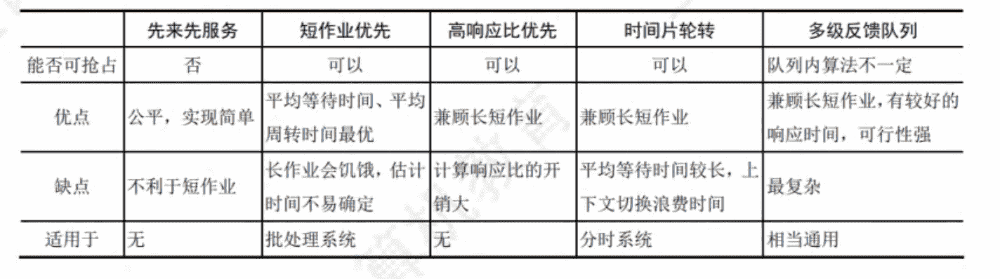

## 2.1进程与线程
- **进程包括三个部分**:
  - 进程控制块PCB:创建进程的时候创建PCB,里边是进程的控制信息,操作系统通过这个来获取进程的信息
  - 数据部分
  - 程序部分<br>
- 进程有5个状态:**运行态**,**就绪态**,**阻塞态**,创建态,终止态<br>前三个是基本状态<br><br>一个进程从运行态变为阻塞态是主动的行为，而从阻塞态变为就绪态是被动的行为，需要其他相关进程的协助。
- 进程可以创建子进程,如果子进程删除,那么子进程的资源要归还父进程,如果父进程删除,子进程也要被删除
- 在操作系统中，终端用户登录系统、作业调度、系统提供服务、用户程序的应用请求等都会引起进程的创建。
- **创建新进程的操作**:
  1. 给进程分配一个唯一的标识号,然后申请一个空白的PCB(PCB是有限的),申请不到就创建失败
  2. 给进程分配资源(这些资源是在PCB中体现的),如果资源不够,那也不算创建失败,而是处于创建态
  3. 初始化PCB,也就是初始化PCB包括的内容第二栏(进程控制和管理信息)
  4. 如果就绪队列还没满,那么这个进程就去排队,变为就绪态等待被调度
- **进程终止的操作**:
  1. 根据进程的PID、UID检测出这个进程的PCB，获取该进程的状态
  2. 然后终止该进程和子孙进程的运行
  3. 把该进程的资源归还给父进程或者是操作系统
  4. 然后把这个进程的PCB给删喽
- 进程之间的通信PV操作是低级通信，效率很低，**高级通信有以下几种**：
  1. **共享存储**：两个进程之间有个共有的内存空间，两个进程都可以通过PV操作对这段空间进行读写
  2. **消息传递**：两个进程之间没有公共的区域，通过发消息来进行通信，这种方式很能支持多CPU系统、分布式系统和计算机网络，所以用途的广
       - 直接通信方式 ：进程把消息发到对面的消息缓冲队列上边，对面的进程从队列上获取消息
       - 间接通信方式：把消息发给中间的实体（信箱），接受进程从信箱里边获取消息
  3. **管道通信**：管道是一个特殊的共享文件，数据在管道里边FIFO,管道两边只能各有一个进程，并且读的时候写进程阻塞，写的时候读进程阻塞<br>这种方式在Linux里边用的很多，Linux里管道文件为4KB，读写速度可能不匹配，当管道空的时候或者满的时候，谁快阻塞谁
   
- 线程是轻量级的进程，在上下文切换的时候时空开销比较小，[线程就像是生产线，进程像工厂](https://www.doubao.com/thread/ab5fe96119646)，TCP（thread）线程控制块和PCB（process）很像，啥都像<br>线程是CPU调度的基本单位,可以独立执行程序
- [**线程的实现**](https://www.doubao.com/thread/a557406390af1)可以分为两类:**用户级线程**(User-Level Thread，ULT)和**内核级线程**(Kernel-Level Thread，KLT)。<br>用户级线程是在用户视角下能看见的线程，操作系统不用干预，所以线程之间的切换不用转换到内核态，开销很小<br>**用户级线程就像是民间组织**，可以非常灵活解决不用内核操心的问题，但是涉及内核的问题（I/O等）就需要和内核商榷，开销大<br>**内核级线程就像是官方机构**，行为调度极为严整，相对重量级，虽然做事效率高，但是消耗大
- [**多线程模型**](https://www.doubao.com/thread/abcc237f909df)：
  - **一对一模型**：每个民间组织对应一个具体的官方负责人，行为调度非常明确，这个民间组织工作受阻也不影响其他活动，但是因为这个组织啥都让负责人负责，所以开销大
    >优点:当一个线程被阻塞后，允许调度另一个线程运行，所以并发能力较强。<br>缺点:每创建一个用户线程，相应地就需要创建一个内核线程，开销较大。
  - **一对多模型**：一个官方负责人管了好几个组织，遇到的问题可以在内部讨论解决，效率高，但是有一个组织遇到问题，整个组织就就会受到影响
    >优点:线程管理是在用户空间进行的，无须切换到核心态，因而效率比较高。<br>缺点:如果一个线程在访问内核时发生阻塞，则整个进程都会被阻塞;在任何时刻，只有一个线程能够访问内核，多个线程不能同时在多个CPU上运行。
  - **多对多模型**：有前两个的优点
- 单处理器中如果有10个进程，可能会有下边几种情况：
   - 一个处于运行态，其余九个处于阻塞态或者就绪态
   - 10个进程全部阻塞
   - 就算10个进程并发执行，也是一个运行九个就绪
- C语言编写的程序在使用内存时一般分为三个段，它们一般是**正文段**(代码和赋值数据段)、**数据堆段**和**数据栈段**。<br>**二进制代码和常量存放在正文段，动态分配的存储区在数据堆段，临时使用的变量在数据栈段。**<br>由此，我们可以确定全局赋值变量在正文段赋值数据段，未赋值的局部变量和实参传递在栈段，动态内存分配在堆段，常量在正文段，进程的优先级只能在 PCB内。
- 在同一进程中，线程的切换不会引起进程的切换。当从一个进程中的线程切换到另一个进程中的线程时，才会引起进程的切换。
- [线程可以节省系统资源](https://www.doubao.com/thread/a1ab29322ff04)，但线程并不能增强进程安全性，因为线程共享进程的地址空间和资源，若一个线程出错，则可能影响整个进程的运行。
- CPU调度以线程为单位,在多处理器中,内核级线程的调度是并行的,用户级线程不行,因为操作系统只能看到进程这一级。
- 从阻塞变为执行才叫唤醒，从就绪变为执行不叫唤醒。
## 2.2CPU调度
- **三种调度**：
	- **低级调度**：进程调度，决定哪个进程获得CPU，发生频率很高，一般几十毫秒一次
	- **中级调度**：把内存中暂时不用的进程调到外存中（挂起态）。
	- **高级调度**：作业调度，把作业从外存调入内存。
- **进行CPU调度的事件**：
	-  创建新进程：父进程和子进程都处于就绪态，操作系统需要决定运行哪个。
	- 进程结束或者被终止，操作系统从就绪队列中选择一个进程运行，没有的话就运行闲逛进程
	- 被阻塞的进程所要的条件被满足之后CPU会决定运行这个进程还是接着运行现在的进程
	- 进程被阻塞之后要选择别的进程运行
- **不能进行调度的情况**：
	- 在执行原子操作的时候
	- 在中断处理的时候，这个中断处理程序属于系统的操作，不属于某个进程所以不能进行调度
- **用户级线程和内核级线程的调度**：
	- 操作系统会选择一个线程，不考虑这个线程属于哪一个进程，就分配时间片之后运行
	- 操作系统不知道有用户级线程的存在，所以操作系统还是跟以前一样选择一个进程发放时间片运行，由进程自己决定运行哪一个线程
- **上下文切换的流程**：
  - 把CPU的信息保存到进程的PCB中，里边有程序计数器和其他寄存器
  - 把这个进程的PCB移入就绪或者阻塞队列
  - 选择另一个进程读取它的PCB
  - 恢复新进程的上下文
  - 跳转到新进程PCB里边PC指向的位置执行
- **CPU调度的算法**：
  - **先来先服务**，效果很不好，因为有利于CPU繁忙型，不利于I/O繁忙型，因为CPU繁忙的作业计算完就走了，I/O繁忙的作业还要等可长时候才开始计算，占着茅坑不拉屎。
  - **短作业优先**，要是一直有短作业来，那长作业要饿死
  - **高相应比优先**：$相应比=\frac{等待时间+要求服务时间}{要求服务时间}$
  - **优先级调度**：
    - 系统进程>用户进程；
    - 交互型进程（前台进程）>非交互型进程（后台进程）
    - I/O型进程>计算型进程，因为I/O很慢，所以要先启动设备
  - **时间片轮转调度**
  - **多级队列调度算法**：把不同的作业分为不同的队列，不同的队列中采用不同的调度算法，要是在多CPU系统中，每个CPU实现一种调度策略，根据用户需求把线程分配到合适的CPU上运行
  - **多级反馈队列调度算法**：
    - 设置多个就绪队列，从第一队列到后续队列优先级依次降低
    - 队列内部的进程都有一个时间片（不是时间片轮转调度），并且后一个队列的时间片比前一个队列的时间片长1倍。
    - 队列内部是FCFS算法，如果这个进程在这个队列的时间片内完成的话就撤离系统，没有完成的话就调离到下一个队列
    - 只有当高优先级的队列为空的时候CPU才会执行低优先级的队列，如果有新进程进入高优先级的队列，CPU立马放弃执行现在低优先级队列的进程

## 2.3同步与互斥
- **基本概念**
	- **临界资源**：一次仅允许一个进程使用的资源；打印机、变量、数据都可以是临界资源
	- **临界区**：访问临界资源的那段代码
	- **同步**：直接制约关系，进程B必须有进程A提供的数据才能运行
	- **互斥**：间接制约关系，进程A和B都需要访问临界资源，但是只能有一个进程访问
>**实现临界区互斥必须遵循的准则**：
>1. **空闲让进**：临界区空闲的时候可以允许一个进程进入临界区
>2. **忙则等待**：临界区有进程的时候其他进程必须等待
>3. **有限等待**：必须保证进程可以在有限的时间内进入临界区，
>4. **让权等待**：当进程不能进入临界区的时候，应该立即释放CPU，防止占着茅坑不拉屎。

- **实现临界区互斥的基本方法**：
	- **软件实现法**
		1. **单标志法**：设置一个公用整形变量turn（指示允许进入临界区的进程编号），有一个缺点：turn如果等于1，但是进程1不进入临界区，这样其他进程也无法进入临界区，违反了空闲让进的原则
		2. **双标志先检查法**：理解了单标志法的缺点之后，使用一个布尔型数组变量flag[i]表示进程i进入临界区的意愿；这样还是有缺点：进程1和进程2同时检查对方的意愿发现都是false，然后下一秒各自改变自己的意愿，结果俩进程都进去了，违反了忙则等待原则
		3. **双标志后检查法**：理解了第二种方法的缺点之后，后检查采用先设置自己的意愿，然后再检查对方的意愿，这样还是有缺点：俩都想进入临界区，结果俩都进不去，违反了空闲让进的原则
		4. **Peterson算法**：结合了第一和第三种算法，用turn解决饥饿问题，用flag[i]解决互斥问题，捋一下：进程0先设置进去的意愿flag[0]=true，然后谦让地把turn设置为1，让进程1先进去（检查的条件：while(flag[1]&&turn\==1)），如果进程1不想进去的话，flag[1]=false，跳出循环，进程0进去；如果进程1想进去，他也会谦让地让进程0进去。**总的来说**：用turn控制谁有权利进去，用flag控制谁想进去；还是有缺点：不满足让权等待（如果某个进程想进去他就一直运行while循环不会释放CPU），但是相比前三算法，这个算法已经够好了
	- **硬件实现法**：
		1. **中断屏蔽方法**：CPU只能在发生中断时才能进行进程的切换，屏蔽中断之后就不能进行进程切换，就能保证进程互斥<br>缺点：
			- 限制了CPU交替执行的能力，系统效率大打折扣
			- 把关中断这种高级别指令交给用户，系统会存在安全问题
			- 不适用多处理器系统，因为关中断就关闭了这个CPU的中断，其他CPU不受影响
		2. **硬件指令方法——TestAndSet指令**：TS指令是原子操作，为每一个临界资源设置一个布尔型共享变量lock，用TS指令检查并设置锁的状态，和turn差不多，只不过这个使用硬件一气呵成的；缺点：不符合让权等待，无法进入临界区的进程会一直占用CPU执行TS指令
		3.  [**硬件指令方法——Swap指令**](https://www.doubao.com/thread/aa85c813b5e47)：Swap指令和TS差不多，都是通过lock来实现互斥，只不过这个Swap是通过与设置的局部变量key交换值来改变的
	- 优点：
		- 简单，容易验证正确性；
		- 适用于任意数目的进程，适用于多处理器系统；
		- 支持系统中有多个临界区，一个临界区一个变量
	- 缺点：
		- 不能实现让权等待，等待进入临界区的进程一直在while检测
		- 随机选择一个进程进入临界区，可能有的进程点背一直选不上，造成饥饿现象
- **互斥锁**（最简单的工具）：进入临界区调用acquire()加锁，退出临界区调用release()释放锁，这两个过程是原子操作，所以用硬件实现
- **信号量**
	- **整型信号量**：用S表示资源数目的整型量，只有三种操作：初始化、wait（减一）、signal（加一）；<br>不符合让权等待原则，只要$S\le0$就会不断循环测试
	- **记录型信号量**：除了有一个value代表资源数目，还有一个进程链表,这个不会一直检测，如果value<0，就把这个进程阻塞然后添加到L队列中，遵循了让权等待
```
	typedef struct{
		int value;
		struct process *L;
	}semaphore;
```
### [管程](https://www.doubao.com/thread/a48417c0e0ef0)
- 管程是一个进程同步管理的进程<br>**由四个部分组成**（管程的组成很像一个类）：
	- 名称
	- 内部数据结构的说明
	- 对里边数据结构进行操作的函数
	- 对共享数据赋初始值的语句
```
monitor Demo{//①定义一个名称为 Demo 的管程/
	/②定义共享数据结构，对应系统中的某种共享资源
	共享数据结构S;
	//对共享数据结构初始化的语句
	init code(){
		S=5;//初始资源数等于5
	}
	take away(){//③过程1:申请一个资源
		对共享数据结构x的一系列处理;
		S--;//可用资源数-1
		...
	}
	give back(){//③过程 2:归还一个资源
		对共享数据结构x的一系列处理;
		S++;//可用资源数+1
		...
	}
}
```
- **条件变量**<br>对条件变量进行操作wait、signal<br>**条件变量和信号量比较**：
	- **相同点**：条件变量的 wait/signal 操作类似于信号量的 P/ V操作，可以实现进程的阻塞/唤醒。
	- **不同点**：条件变量没有值，调用wait操作的进程是把自己插入到等待队列中，调用signal是把唤醒
---
- [信号量等于0的时候的理解](https://www.doubao.com/thread/adabb502dbcd9)：<br>当信号量=0时，仍然可以进行wait操作，因为现在虽然没有资源了，但是仍然可以分配，如果有进程释放资源就可以给他分配了，小于0就不行。
# 2.4死锁
- **产生死锁的原因**：
	- **系统资源的竞争**：不可剥夺的资源（打印机等）的数量不满足多个进程运行的需要
	- **进程的推进顺序不合法**
- **死锁产生的必要条件**：
	- **互斥条件**：也就是临界资源，只允许一个进程使用
	- **不可剥夺条件**：只能主动释放，不能抢占资源
	- **请求并保持条件**：已分配给自己的资源不会被释放
	- **循环等待条件**：跟图中一样，像一条蛇咬着自己的尾巴
- **死锁的处理策略**：
	- **死锁预防**：破坏产生死锁的条件
	- **死锁避免**：避免系统进入不安全状态，银行家算法
	- **死锁的检测及解除**

- **死锁避免与死锁检测对比**：<br>死锁避免：系统需要知道进程的生命周期内所需的全部资源；<br>死锁检测：不需要知道进程需要啥，只需要检测是否发生死锁，也就是要是到当前时刻进程的需求
- **死锁解除**：
	- **资源剥夺法**：剥夺死锁进程的资源
	- **撤销进程法**：撤销部分或全部死锁进程，代价很大，因为有的进程可能快运行完了，撤销又要从头开始
	- **进程回退法**：把产生死锁的进程回退到可以避免死锁的状态，这个方法要求系统设置还原点