# 5.1 I/O管理基础
- I/O控制方式:
  - 查询
  - 中断
  - DMA:有四个寄存器 
    1. 命令/状态寄存器(CR)。接收从 CPU 发来的 I/O 命令、有关控制信息，或设备的状态。
    2. 内存地址寄存器(MAR)。在输入时，它存放将数据从设备传送到内存的起始目标地址;在输出时，它存放由内存到设备的内存源地址。
    3.  数据寄存器(DR)。暂存从设备到内存或从内存到设备的数据。
    4.  数据计数器(DC)。存放本次要传送的字(节)数。
    >DMA传送数据过程:设备发送DMA请求,CPU向控制器发送指令,同时设置MAR和DC,然后把控制权交给控制器,控制器和内存直接交互,不需要CPU参与,数据传送完,控制器向CPU发送中断请求。只有传送的开始和结束需要CPU参与
  - 通道：通道与 DMA 方式的区别是:DMA 方式需要 CPU 来控制传输的数据块大小、传输的内存位置，而通道方式中这些信息是由通道控制的。另外，每个DMA 控制器对应一台设备与内存传递数据，而一个通道可以控制多台设备与内存的数据交换。 
- **I/O软件层次结构**：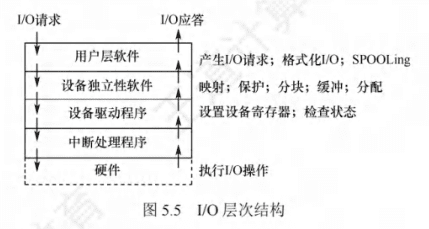 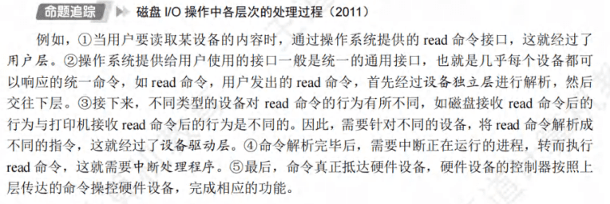
- **I/O设备接口分类**：
  - **字符设备接口**：鼠标这种，没有地址，采用中断驱动方式，建议了一个字符缓冲区，读写都是对缓冲区进行
  - **块设备接口**：硬盘这种，有地址，采用DMA方式，
  - **网络设备接口**：许多操作系统提供的网络10 接口为网络套接字接口，套接字接口的系统调用使应用程序创建的本地套接字连接到远程应用程序创建的套接字，通过此连接发送和接收数据。
- **阻塞I/O与非阻塞I/O**：
  - 阻塞I/O是指当用户进程调用I/O操作时,如果I/O操作没有完成,则用户进程会被阻塞,直到I/O操作完成。
  - 非阻塞I/O是指当用户进程调用I/O操作时,如果I/O操作没有完成,则用户进程可以做其他的事情，在这个阶段进程不断的询问I/O操作是否完成。
# 5.2设备独立性软件
- 磁盘高速缓冲技术用来提高磁盘的读写速度。逻辑上属于磁盘,物理上属于内存。有两种形式:
  - 在内存中开辟一个单独的空间作为缓冲区,大小固定。
  - 将未利用的内存空间作为一个缓冲池,供请求分页系统和磁盘 I/O 时共享。
- **单缓冲**: 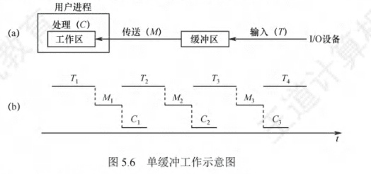 必须等缓冲区满后才能从缓冲区取数据。T和C是可以并行的,所以就有单缓冲区处理每块数据的平均时间是Max(T,C)+M。 缓冲区是共享资源,所以需要互斥访问。
- **双缓冲**: 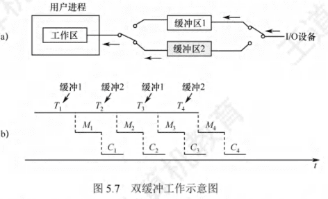 缓冲区1满了向缓冲区2输入,缓冲区2满了向缓冲区1输入,这样就可以并行的处理每块数据C和M是可以与T并行的。处理时间为Max(T,C+M)。
- **循环缓冲**:跟数据结构中循环队列差不多。
- **缓冲池**: 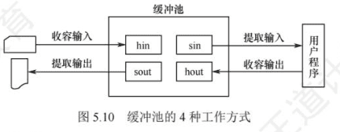 管理了多个缓冲区,plus版
## 设备分配与回收
- 在系统中，可能存在多个通道，每个通道可以连接多个控制器，每个控制器可以连接多个物理设备。设备分配的数据结构要能体现出这种从属关系
  - **设备控制表**(DCT): 每个物理设备对应一个设备控制表，用于记录设备的状态信息。
  - **控制器控制表**(COCT): 每个控制器对应一个控制器控制表，用于记录控制器的状态信息。每个控制器由一个通道控制。
  - **通道控制表**(CHCT): 每个通道对应一个通道控制表，用于记录通道的状态信息。
  - **系统设备表**(SDT):整个系统只有一张SDT，用于记录系统中所有设备的状态信息。每个物理设备对应一个表目。
- **独占设备**:将它分配给某个进程后，便由该进程独占，直至进程完成或释放该设备
- **共享设备**:可将它同时分配给多个进程，需要合理调度各个进程访问该设备的先后次序。
- **虚拟设备**属于共享设备。
- **设备分配步骤**:
  - 检查设备表，找到空闲设备,若忙的话,就把该进程的PCB挂载到等待队列
  - 分配控制器,根据DCT找到COCT,找到空闲控制器,若忙的话,就把该进程的PCB挂载到等待队列
  - 分配通道,根据COCT找到CHCT,找到空闲通道,若忙的话,就把该进程的PCB挂载到等待队列
- 为了实现设备的独立性，进程中应使用逻辑设备名来请求某类设备。但是，系统只识别物理设备名，因此在系统中需要配置一张**逻辑设备表LUT**，用于将逻辑设备名映射为物理设备名。
  - 单用户系统中只设置一张LUT
  - 多用户系统中为每个用户设置一张LUT,同时在系统中配置系统设备表,所以不同的用户可以使用相同的逻辑设备名。
- SPOOLing技术(假脱机技术)：将用户程序的输入和输出信息暂时保存在磁盘上，而不是直接送入打印机或从键盘上接收。将独占设备改造成共享设备，解决CPU和设备之间速度不匹配的问题。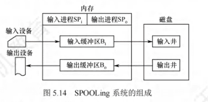
  - **输入井和输出井**：在磁盘中开辟两个缓冲区,一个收容输入设备的数据,一个收容用户程序输出的数据。
  - **输入缓冲区和输出缓冲区**：在内存中开辟两个缓冲区,一个收容输入井的数据,一个收容输出井的数据。
    > 真奇怪，输出数据先输出到输出井（在磁盘上），然后再输出到输出缓冲区（在内存上），然后再输出到打印机。
    >> 输出程序->输出井（磁盘）->输出缓冲区（内存）->打印机 我感觉输出到输出井的时候肯定经过了内存，但是那块内存不叫输出缓冲区
- **设备驱动程序**：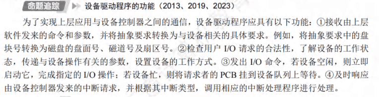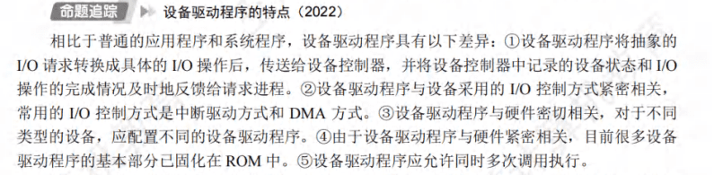
# 5.3磁盘和固态硬盘
- 之前的磁盘内外磁道的扇区数是相同的，但是现在为了提高磁盘的存储容量，把盘面划分为了若干个环带，同一环带内的所有磁道具有相同的扇区数
- 磁盘地址用“柱面号、盘面号、扇区号”来表示。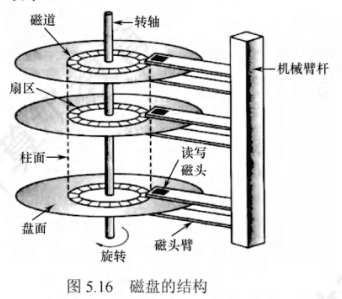
  > 柱面号也就是磁道号
- **新磁盘安装操作系统的过程**：
  1. **磁盘初始化**也就是低级格式化（物理格式化），把空白的磁盘分成扇区，能进行读写操作
  2. **分区**：
    - **将磁盘分区**，也就是C盘D盘这样，每个分区的起始扇区和大小都记录在磁盘主引导记录的分区表中。
    - **高级格式化**（逻辑格式化）：将初始文件系统数据结构存储到磁盘上，这些数据结构包括空闲空间和已分配空间，以及一个初始为空的目录，建立根目录、对保存空闲磁盘块信息的数据结构进行初始化。
      > 扇区的单位太小，所以操作系统将多个相邻的扇区组合在一起，形成一簇(在Linux 中称为块)。为了更高效地管理磁盘，一簇只能存放一个文件的内容，文件所占用的空间只能是簇的整数倍;如果文件大小小于一簇(甚至是0字节)，也要占用一簇的空间。
    - **引导块**：BI/OS有一小部分自举装入程序，然后接力到MBR，MBR再接力到引导分区
    - **坏块**：其实就是用某种机制使系统不去使用坏块。
- **磁盘的存取时间**：寻道时间+旋转到特定扇区的时间+传输时间（也就是扫描这个扇区的时间）
- **磁盘调度算法**：
  - 先来先服务算法(FCFS)
  - 最短寻道时间优先（SSTF）：选择与当前磁头所在磁道距离最近的磁道；这个可能会让磁头一直在小范围内移动，会造成及饥饿现象。
  - 扫描算法（SCAN）：磁头从一个磁道向另一个磁道移动，直到到达最外磁道。
  - 循环扫描（C-CSAN）：磁头从一个磁道向另一个磁道移动，直到到达最外磁道，然后再向一个磁道移动，直到到达最内磁道。
- **减少延迟时间的方法**：磁盘是连续自转设备，磁头读入一个扇区后，需要经过短暂的处理时间，才能开始读入下一个扇区。若逻辑上相邻的块在物理上也相邻，则读入几个连续的逻辑块可能需要很长的延迟时间。为此，可对一个盘面的扇区进行交替编号，即让逻辑上相邻的块物理上保持一定的间隔，于是读入多个连续块时能够减少延迟时间。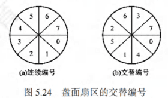
- **改善磁盘I/O性能的方法**：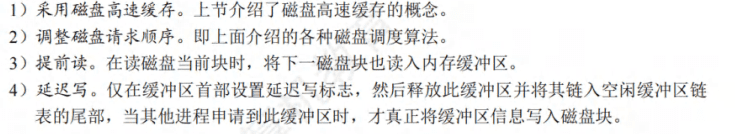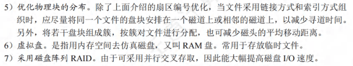
- 固态硬盘：
  - 和U盘没有本质区别，只是容量大，存取性能更好。 随机写很慢，因为擦除块比较慢，通常比访问页高一个数量级。其次，如果写操作试图修改一个包含已有数据的页P，那么这个块中所有含有用数据的页都必须被复制到一个新(擦除过的)块中，然后才能进行对页P的写操作。
  - **磨损均衡**：
    - **动态磨损均衡**：写入数据时，自动选择较新的闪存块。
    - **静态磨损均衡**：SSD也会监测并自动进行数据分配，让老的闪存块承担无须写数据的存储任务，同时让较新的闪存块腾出空间，平常的读/写操作在较新的闪存块中进行。

