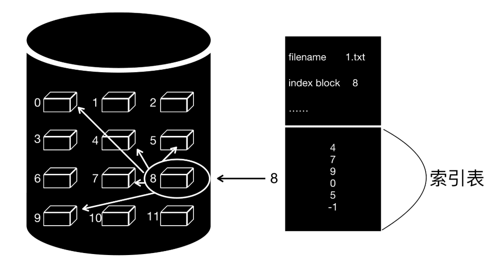
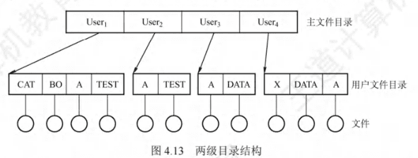
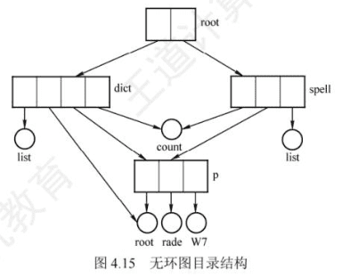
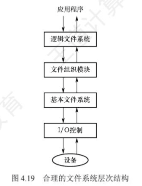
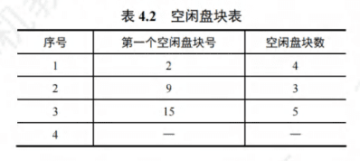

# 4.1文件系统基础
- 文件控制块(File Control Block，FCB)是用来存放控制文件需要的各种信息的数据结构，**以实现按名存取**。文件与 FCB 一一对应。
- 文件很多的时候,文件目录会占用很多的盘块,在查找目录的时候会把第一个盘块调入内存,然后用给定的文件名逐一比较,但是在这个过程中只用到了文件名,其他的信息都没有用,只有找到对应的文件才把对应的目录项调入内存,这样会浪费很多时间,所以需要把目录项调入内存,这样就可以直接比较文件名了,这就是索引文件。
- **文件打开的过程**:用户对一个文件多次读写时,为了避免多次重复地检索目录,先利用系统调用open打开文件,系统维护一个打开文件表。打开的同时系统会给用户一个文件描述符(索引号),用户再次打开这个文件时,通过文件描述符来访问这个文件。文件不用时,系统调用close关闭文件,系统会回收这个文件描述符,从打开文件表中删除这个表目录。
- **文件关闭过程**:在操作系统中，当文件不再使用时，会利用系统调用close来关闭文件。关闭文件时，会删除单个进程的打开文件表中的相应条目，系统表中的相应打开计数器（Open Count）也会递减。当打开计数器为0时，表示该文件不再被使用，并且可以从系统表中删除相应条目。
- 只要完成了文件打开 open()系统调用，后面再使用 read()、write()、Lseek()、close()等文件操作的系统调用，就不再使用文件名，而使用文件描述符。
- **文件的逻辑结构**:
  - **无结构文件(流式文件)**:无结构文件是最简单的文件组织形式，由字符流构成，长度以字节为单位。访问流式文件通过读/写指针来定位字节。系统中的源程序、可执行文件、库函数等多采用无结构文件，但由于其无结构，记录访问只能通过穷举搜索，因此对很多应用不适用。
  - **有结构文件(记录式文件)**: 
   **定长记录**: 定长记录是指每个记录的长度相等，每个记录的结构是相同的。定长记录的优点是存取速度快，缺点是浪费存储空间。 
   **不定长记录**: 不定长记录是指每个记录的长度不等，每个记录的结构也不相同。不定长记录的优点是存储空间利用率高，缺点是存取速度慢。
    - 顺序文件：顺序文件是指文件中的记录按照物理顺序存储，每个记录的物理地址与其逻辑地址相同。对于定长记录的顺序文件的优点是检索时可以用折半查找,查找速度快，缺点是插入和删除记录时需要移动大量记录。
    - 索引文件:配了一张索引表,每个文件都有一个索引项
- **文件的物理结构**:
  - **连续分配**: 连续分配是指将文件的所有记录存储在连续的物理块中。支持顺序访问和随机访问,但是会有外部碎片
  - **链式分配**:消除了外部碎片,修改插入也很方便
    - 隐式链接: 隐式链接是指在文件的每个记录中增加一个指针域，指向下一个记录的盘块号。只能用于顺序访问。
    - 显式链接: 显式链接是指将用于链接文件各物理块的指针，显式地存放在内存的一张链接表中，该表在整个磁盘中仅设置一张，称为文件分配表(File Allocation Table，FAT)。可以顺序访问和随机访问。
  - **索引分配**:在一个盘块内集合了多个记录,每个记录都有一个索引项,索引项中包含了记录的物理地址。这种分配方法也不会产生外部碎片
  - **混合索引分配**:为了照顾大中小文件,把小文件的盘块地址直接放入FCB,中型文件采用需要先从 FCB 中找到该文件的索引表，从中获得该文件的盘块地址，即为一次间址。大文件采用两级或三级索引分配
# 4.2目录
- FCB 的有序集合称为文件目录，一个FCB就是一个文件目录项。
- **目录结构**:
  - **单级目录结构**:对多用户很不利,因为用户与用户之间也不允许文件重名  
  - **两级目录结构**:虽然把用户分开了,但是缺乏灵活性,不能对文件进行分类 
  - **树形目录结构**:也就是Windows的目录结构
  - **无环图目录结构**:在树的基础上进行改进,一个文件可以有多个父亲,虽然很灵活,但是管理复杂,有一个计数器,用来记录有多少个父亲,当计数器为0时,表示没有父亲,可以删除了
- 硬链接是基于索引节点的共享方式，文件的信息不放在目录中，而是放在索引节点中，多个目录项指向同一个索引节点。也是用一个count计数,当count为0时,才可以删除 软链接就是将到达共享文件的路径保存下来，当要访问文件时，根据路径寻找文件。硬链接的查找速度比软链接快。
- 目录管理最基本的功能是按名存取 
# 4.3文件系统
- **[文件系统结构](https://www.doubao.com/thread/ac4346e6e8dd6)**: 
- **文件系统布局**: 
  - **主引导记录**: 主引导记录是操作系统的引导程序，它位于磁盘的第一个扇区，用于引导操作系统。bios运行之后就到这个了
  - **引导块**: 引导块是操作系统的引导程序，它位于磁盘的第二个扇区，用于引导操作系统。每个分区都是统一从引导块开始
  - **超级块**: 超级块是文件系统的控制块，它位于磁盘的第三个扇区，用于存储文件系统的控制信息。
  - **[空闲块](https://www.doubao.com/thread/a576fe60b41ae)**:空闲块是指那些当前没有被任何文件或目录占用的存储块。这些存储块可以用于存储新的文件数据、目录信息或者扩展现有文件的大小
- **磁盘空闲空间的管理方法**:
  - **空闲表法**:每个空闲区对应一个空闲表项,其中包括表项序号、该空闲区的第一个空闲盘块号、空闲盘块数，然后再把所有空闲区按照起始盘块号递增的顺序排列 盘块回收的时候跟内存回收一样，相邻的空闲区合并成一个空闲区。然后更改表项
  - **空闲链表法**：
    1. **空闲盘块链**：将磁盘上的所有空闲空间以盘块为单位拉成一条链。但是这种方法会导致空闲盘块链很长
    2. **空闲盘区链**：将磁盘上的所有空闲盘区拉成一条链，每个盘区包含若干相邻的盘块。这种方法虽然分配回收效率高，长度也比较短，但是分配回收的过程很复杂
  - **位示图法**：使用一个位示图来表示磁盘上的空闲空间。位示图是一个位向量，其中每个位表示一个盘块的状态。如果一个盘块是空闲的，那么对应的位就被置为1，否则就被置为0。
    > 这种方法有的从0开始编号，有的从1开始编号，很简单，就是把盘块号按写字的顺序一位一位对照起来
  - **成组链接法**：前两种方法都不适应大型文件系统，所以UNIX使用的是成组链接法，我不明白这种方法是咋弄着嘞，看不懂，[参考这个](https://blog.csdn.net/qq_45744501/article/details/116953538)
- 