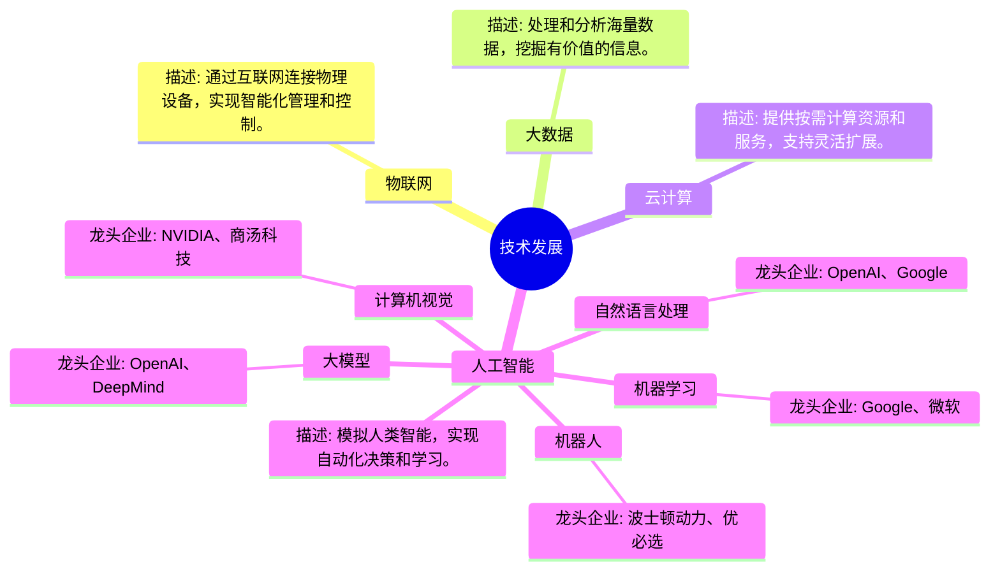
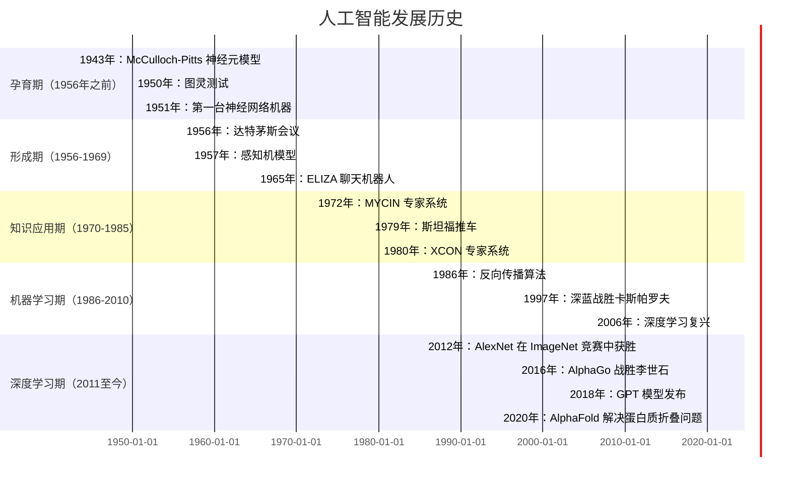

## 第一节课

```mermaid
mindmap
  root((技术发展))
    物联网
      ::icon(fa fa-wifi)
      描述: 通过互联网连接物理设备，实现智能化管理和控制。
    大数据
      ::icon(fa fa-database)
      描述: 处理和分析海量数据，挖掘有价值的信息。
    云计算
      ::icon(fa fa-cloud)
      描述: 提供按需计算资源和服务，支持灵活扩展。
    人工智能
      ::icon(fa fa-brain)
      描述: 模拟人类智能，实现自动化决策和学习。
      机器人
        ::icon(fa fa-robot)
        龙头企业: 波士顿动力、优必选
      自然语言处理
        ::icon(fa fa-comment-dots)
        龙头企业: OpenAI、Google
      计算机视觉
        ::icon(fa fa-eye)
        龙头企业: NVIDIA、商汤科技
      机器学习
        ::icon(fa fa-cogs)
        龙头企业: Google、微软
      大模型
        ::icon(fa fa-project-diagram)
        龙头企业: OpenAI、DeepMind
```
## 第二节课

```mermaid
gantt
    title 人工智能发展历史
    dateFormat  YYYY-MM-DD
    section 孕育期（1956年之前）
    1943年：McCulloch-Pitts 神经元模型       :done, 1943-01-01, 1d
    1950年：图灵测试                         :done, 1950-01-01, 1d
    1951年：第一台神经网络机器              :done, 1951-01-01, 1d
    section 形成期（1956-1969）
    1956年：达特茅斯会议                     :done, 1956-01-01, 1d
    1957年：感知机模型                       :done, 1957-01-01, 1d
    1965年：ELIZA 聊天机器人                 :done, 1965-01-01, 1d
    section 知识应用期（1970-1985）
    1972年：MYCIN 专家系统                  :done, 1972-01-01, 1d
    1979年：斯坦福推车                      :done, 1979-01-01, 1d
    1980年：XCON 专家系统                   :done, 1980-01-01, 1d
    section 机器学习期（1986-2010）
    1986年：反向传播算法                    :done, 1986-01-01, 1d
    1997年：深蓝战胜卡斯帕罗夫             :done, 1997-01-01, 1d
    2006年：深度学习复兴                    :done, 2006-01-01, 1d
    section 深度学习期（2011至今）
    2012年：AlexNet 在 ImageNet 竞赛中获胜  :done, 2012-01-01, 1d
    2016年：AlphaGo 战胜李世石              :done, 2016-01-01, 1d
    2018年：GPT 模型发布                     :done, 2018-01-01, 1d
    2020年：AlphaFold 解决蛋白质折叠问题    :done, 2020-01-01, 1d

```
