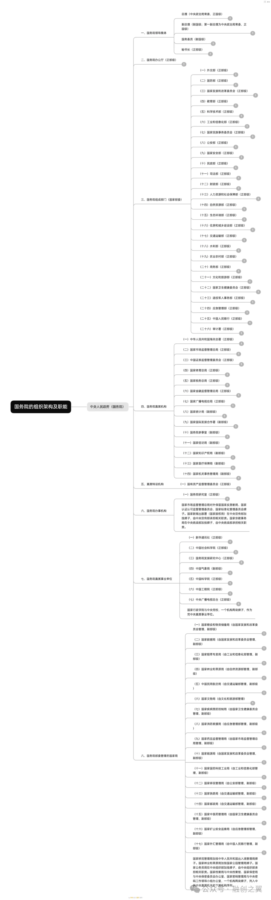

中国的国家机器运转以**中国共产党领导**为核心，通过**中央与地方分级管理**实现国家治理。以下从部门职能、央地关系、官员等级三方面解析：

---

### **一、国家机器运转的核心逻辑**
1. **经济基础**：  
   - **税收与财政**：通过征税和发行国债维持政府运作（如2020年全国税收占财政收入85%以上）。  
   - **金融控制**：央行通过货币政策（如利率调整、货币发行）调控经济流动性。  
   - **国有企业与土地财政**：国企利润和土地出让金是重要财源（如2023年国企营收占比GDP约30%）。  

2. **社会管理**：  
   - **公共安全**：公安、司法部门维护治安，打击犯罪。  
   - **公共服务**：教育、医疗、交通等部门提供基础服务（如教育部管理全国学校）。  

---

### **二、国家部门职能划分**
#### **（一）中央政府（国务院）组成部门**  
| **部门**               | **核心职能**                                                                 |
|------------------------|-----------------------------------------------------------------------------|
| 外交部                 | 处理外交事务，维护国家主权与利益（如国际条约谈判）                          |
| 国防部                 | 领导武装力量建设，制定军事战略                                              |
| 国家发改委             | 制定经济规划，协调重大项目建设（如“十四五”规划）                            |
| 财政部                 | 管理国家财政收支，编制预算决算                                              |
| 公安部                 | 维护社会治安，管理户籍、出入境等                                            |
| 教育部                 | 统筹全国教育体系，推进教育改革                                              |

#### **（二）地方政府部门**  
| **层级**       | **典型部门**       | **职能重点**                                   |
|----------------|--------------------|-----------------------------------------------|
| 省级政府       | 省教育厅、财政厅   | 执行中央政策，管理本省教育、财政等事务        |
| 地市级政府     | 市交通局、卫健委   | 负责城市建设、公共卫生等具体实施              |
| 县级政府       | 县农业农村局       | 落实乡村振兴、基层治理                        |

---

### **三、中央与地方职能关系**  
1. **中央主导宏观决策**：  
   - 制定全国性法律、经济政策（如《民法典》、减税政策）。  
2. **地方负责执行与细化**：  
   - 省级政府根据中央规划制定实施细则（如各省“碳达峰”方案）。  
3. **财政分配**：  
   - 中央通过转移支付平衡区域发展（如2023年中央对地方转移支付超10万亿元）。  

---

### **四、官员等级与职能**  
| **级别**       | **对应职务**               | **职能范围**                                 |
|----------------|----------------------------|---------------------------------------------|
| 国家级正职     | 国务院总理                 | 领导国务院全面工作，向全国人大报告          |
| 省部级正职     | 省长、部长                 | 主政一省或一部，落实中央决策                |
| 厅局级正职     | 地级市市长、司长           | 管理地市或部委内设机构                      |
| 县处级正职     | 县长、处长                 | 负责县域治理或部门具体业务                  |
| 乡科级正职     | 乡镇长、科长               | 基层政策执行与公共服务                      |

---

### **五、其他关键机制**  
1. **党政关系**：党委（党组）在政府部门中发挥领导作用（如省委书记领导省政府）。  
2. **监察体系**：国家监委与地方监委监督公职人员（如查处贪污渎职）。  
3. **民主集中制**：决策时“少数服从多数”，执行时“下级服从上级”。  

---

### **总结**  
国家机器通过**“中央决策-地方执行”**的垂直体系运转，部门间分工明确（如外交、国防、财政），官员等级与职能严格对应。理解这一架构需结合经济基础（税收、金融）、政治制度（党政关系）和社会治理（公共服务）三方面。

---
### 总图

