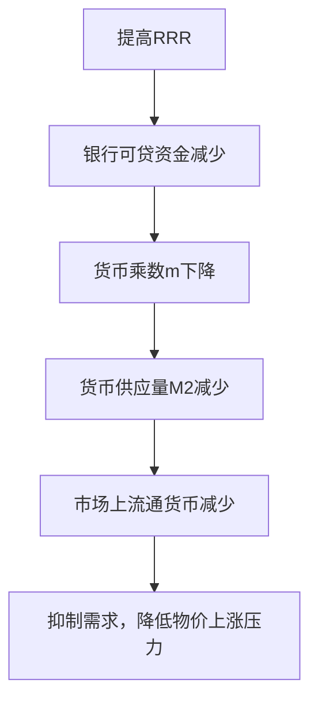
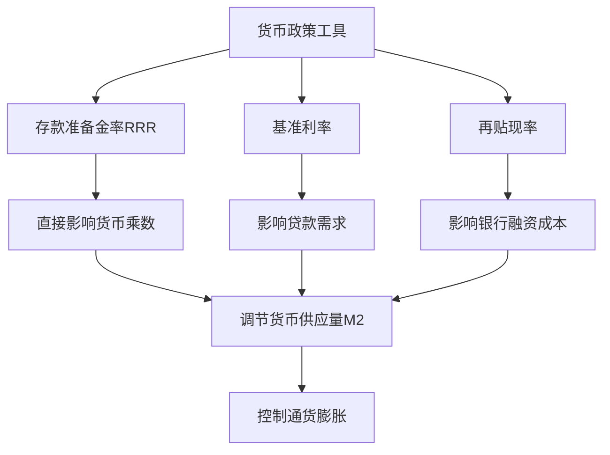
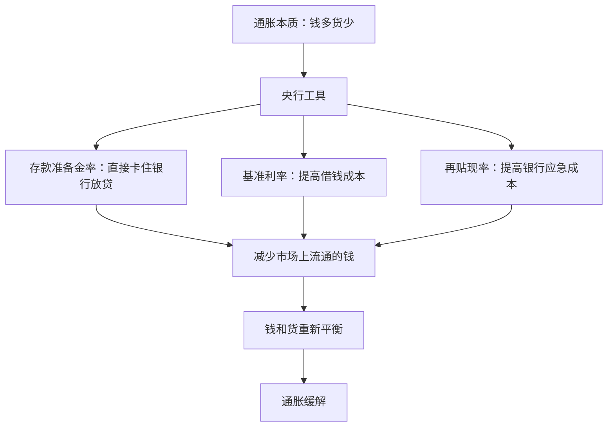

---

### **一、基础概念定义（公式化表达）**
#### **1. 存款准备金率（Required Reserve Ratio, RRR）**
- **定义**：商业银行必须存放在央行的资金占其存款总额的比例。  
- **公式**：  
  $$
  \text{存款准备金} = \text{银行存款总额} \times \text{存款准备金率}
  $$
- **作用**：控制银行的可贷资金规模，直接影响**货币供应量**。

#### **2. 央行基准利率（Benchmark Interest Rate）**
- **定义**：央行向商业银行发放贷款的利率（如中期借贷便利MLF利率），是市场利率的“锚”。  
- **公式**：  
  $$
  \text{市场利率} = \text{基准利率} + \text{风险溢价}
  $$
- **作用**：通过改变借贷成本，调节企业和个人的**贷款需求**。

#### **3. 再贴现率（Rediscount Rate）**
- **定义**：商业银行将未到期的票据抵押给央行获取现金时，央行收取的利率。  
- **公式**：  
  $$
  \text{商业银行融资成本} = \text{再贴现率} + \text{操作成本}
  $$
- **作用**：影响商业银行的短期流动性，间接调控市场资金松紧。

---

### **二、核心逻辑：货币创造与通货膨胀**
#### **1. 货币乘数模型（关键公式）**
货币供应量（M2）由**基础货币**（B）和**货币乘数**（m）共同决定：  
$$
M2 = B \times m
$$  
其中，货币乘数 \( m \) 与存款准备金率（RRR）成反比：  
$$
m = \frac{1}{RRR}
$$  
（注：此为简化模型，实际中还需考虑现金漏损率等因素）

#### **2. 通货膨胀的根源**  
当货币供应量（M2）增速超过商品/服务生产增速时，过多的货币追逐过少的商品 → **物价上涨（通货膨胀）**。  
数学表达：  
$$
\text{通胀率} \propto \frac{\Delta M2}{\Delta GDP}
$$

---

### **三、为什么提高存款准备金率（RRR）能抑制通胀？**
#### **1. 逻辑链条（流程图）**  

#### **2. 定量示例**  
假设：  
- 初始存款准备金率 \( RRR = 10\% \) → 货币乘数 \( m = 1/0.1 = 10 \)  
- 基础货币 \( B = 1 \)万亿元 → 货币供应量 \( M2 = 1 $\times$ 10 = 10 \)万亿元  

若央行将RRR提高至20%：  
- 新货币乘数 \( m' = 1/0.2 = 5 \)  
- 新货币供应量 \( M2' = 1 $\times$ 5 = 5 \)万亿元  
→ **货币供应量直接减半**，抑制通胀。

---

### **四、三大工具的联系与区别（对比表）**
| **工具**         | **作用对象**       | **传导机制**                     | **政策效果速度** |  
|------------------|--------------------|----------------------------------|------------------|  
| **存款准备金率** | 银行可贷资金       | 直接减少货币乘数 → 收缩货币供应   | 快（立竿见影）   |  
| **基准利率**     | 借贷成本           | 提高利率 → 抑制贷款需求 → 减少货币流通 | 较慢（需时间传导）|  
| **再贴现率**     | 银行短期融资成本   | 提高融资成本 → 银行减少向央行借款  | 中等（依赖银行行为）|  

**共同目标**：通过调节**货币供应量**或**货币流通速度**，控制通胀。

---

### **五、实例分析（中国央行操作）**
- **场景**：CPI（消费者物价指数）同比上涨5%，通胀压力显著。  
- **央行对策**：  
  1. **提高RRR**（如从12%→15%）→ 直接减少银行可贷资金。  
  2. **上调基准利率**（如MLF利率从2.5%→3%）→ 提高企业和个人贷款成本。  
  3. **提高再贴现率**（如从2%→2.5%）→ 增加商业银行短期融资成本。  
- **综合效果**：  
  $$
  \Delta M2 \downarrow \quad \Rightarrow \quad \text{通胀率} \downarrow
  $$

---

### **六、系统总结（理科思维导图）**

---

### **七、记忆技巧与考点**
1. **公式记忆**：  
   - 货币乘数 \( m = 1/RRR \)（反比关系）。  
   - 通胀 ≈ 货币超发（M2增速 - GDP增速）。  
2. **类比理解**：  
   - 银行系统像“水库”，RRR是“闸门高度”，提高RRR → 闸门升高 → 流出水量（贷款）减少。  
3. **真题示例**：  
   **题目**：央行提高存款准备金率会导致？  
   **选项**：A. 货币供应量增加  B. 市场利率下降  C. 银行贷款减少  D. 通胀加剧  
   **答案**：C（银行贷款减少 → 货币供应量下降 → 抑制通胀）。

---
## **最简化的语言和类比**重新解释这些概念

---

### **一、核心概念一句话版**
1. **存款准备金率**：  
   **银行每收到100元存款，必须上交央行“保管”的比例**。  
   *例：准备金率10% → 银行每收100元，上交10元，剩下90元可贷款。*

2. **央行基准利率**：  
   **央行借给商业银行钱的“利息成本”**。  
   *例：基准利率5% → 商业银行向央行借100元，一年后还105元。*

3. **再贴现率**：  
   **商业银行急用钱时，把客户的欠条（如商业票据）抵押给央行换现金，支付的“手续费率”**。  
   *例：再贴现率3% → 商业银行用100元欠条换现金，需付3元手续费。*

---

### **二、为什么提高存款准备金率能抑制通胀？**
#### **1. 核心逻辑（类比水库放水）**
- **银行系统 = 水库**  
  - 存款准备金率 = 水库闸门的高度  
  - 贷款 = 从水库流出的水  
  - 货币总量 = 水库流出的总水量  

- **提高准备金率 → 闸门升高 → 流出水减少**  
  *例：准备金率从10%→20%，银行可贷的钱从90元→80元，市场上流通的钱变少。*

#### **2. 通胀的本质**  
**钱太多，商品太少 → 物价上涨**。  
*例：全社会有100元，对应100个苹果 → 1元/个；若钱变200元，苹果还是100个 → 2元/个。*

#### **3. 提高准备金率如何起作用？**  
- **直接减少银行能贷出去的钱** → 企业和个人能借到的钱变少 → 消费和投资减少 → 商品需求下降 → 物价上涨压力缓解。

---

### **三、三大工具的区别（用“借钱”场景理解）**
1. **存款准备金率**：  
   **控制银行手里有多少钱能借出去**（物理限制）。  
   *例：你妈规定你每月零花钱的50%必须存起来，剩下的才能花。*

2. **央行基准利率**：  
   **控制银行向央行借钱的成本**，进而影响企业和个人的贷款利息。  
   *例：你向朋友借钱，朋友说：“利息从5%涨到8%”，你借钱更犹豫了。*

3. **再贴现率**：  
   **控制银行急用钱时的“应急资金”成本**。  
   *例：你突然缺钱，把游戏机抵押给二手店换现金，店主收的手续费变高了。*

---

### **四、实际案例（结合生活）**
#### **场景：抑制猪肉涨价**
1. **通胀现象**：猪肉从20元/斤涨到30元/斤。  
2. **原因**：市场上钱太多（比如发消费券、贷款容易），但猪肉产量没增加。  
3. **央行对策**：  
   - **提高存款准备金率** → 银行能贷给养猪场的钱减少 → 养猪场无法扩大规模 → 猪肉供应难增加。  
   - **同时**，贷款利息上升 → 居民减少贷款消费 → 猪肉需求下降 → 价格回落。

---

### **五、总结（理科思维导图）**

---

### **六、记忆技巧**
- **存款准备金率** → **“钱被锁住”**（像保险箱）。  
- **基准利率** → **“借钱贵不贵”**（像贷款利息）。  
- **再贴现率** → **“急用钱的手续费”**（像典当行）。  

下次看到新闻说“央行提高准备金率”，直接联想：**这是要把市场上的钱“抽走”一部分，防止物价涨太快**。