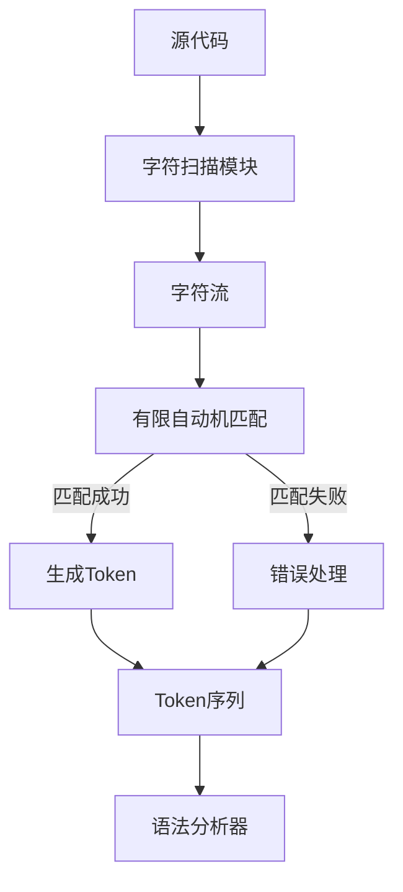

### **词法分析器（Lexer）的定义与组成**

词法分析器是编译器的第一个阶段，负责将**源代码字符流**转换为**有意义的词法单元（Token）序列**，为后续语法分析提供输入。以下是其核心组成内容：

---

### **1. 词法分析器的核心组成**

#### **(1) 字符扫描模块**
- **作用**：逐字符读取源代码，生成字符流。
- **输入**：源代码文本（如 `a = 1 + 2;`）。
- **输出**：字符序列（如 `['a', ' ', '=', ' ', '1', '+', '2', ';']`）。

#### **(2) 正则表达式规则库**
- **作用**：定义各类词法单元的匹配模式。
- **示例规则**：
  - **标识符**：`[a-zA-Z_][a-zA-Z0-9_]*`
  - **整数**：`[0-9]+`
  - **运算符**：`+`, `-`, `*`, `/`
  - **关键字**：`if`, `else`, `while`

#### **(3) 有限自动机（Finite Automata）**
- **作用**：实现正则表达式的匹配逻辑，判断字符序列是否匹配某个词法单元。
- **类型**：
  - **NFA（非确定有限自动机）**：允许同一输入对应多个转移路径。
  - **DFA（确定有限自动机）**：每个输入对应唯一转移路径（高效，用于最终实现）。

#### **(4) Token生成器**
- **作用**：将匹配的词素（Lexeme）转换为Token。
- **Token格式**：`<类型, 属性>`。
  - **示例**：
    - `Identifier(a)`：类型为标识符，属性为名称`a`。
    - `Number(123)`：类型为整数，属性为值`123`。

#### **(5) 错误处理模块**
- **作用**：检测非法字符或词法错误（如未闭合的字符串）。
- **处理方式**：
  - 跳过非法字符并报告错误。
  - 恢复至可继续分析的状态。

#### **(6) 符号表（Symbol Table）**
- **作用**：记录标识符的名称和类型（如变量名、函数名），供后续阶段使用。
- **示例**：

| 标识符 | 类型  |  作用域   |
| :-: | :-: | :----: |
|  a  | int | global |

---

### **2. 词法分析器的工作流程**


#### **流程说明**：
1. **字符扫描**：逐字符读取源代码，生成字符流。
2. **自动机匹配**：通过DFA判断字符序列是否匹配某个词法单元。
3. **Token生成**：将匹配的词素转换为Token。
4. **错误处理**：处理非法字符或格式错误。
5. **输出Token序列**：传递给语法分析器。

---

### **3. 示例：词法分析过程**
#### **输入代码**：
```c
int a = 42;
```

#### **处理步骤**：
1. **字符流**：`['i', 'n', 't', ' ', 'a', ' ', '=', ' ', '4', '2', ';']`
2. **匹配过程**：
   - `int` → 匹配关键字 `Keyword(int)`。
   - `a` → 匹配标识符 `Identifier(a)`。
   - `=` → 匹配运算符 `Operator(=)`。
   - `42` → 匹配整数 `Number(42)`。
   - `;` → 匹配分隔符 `Semicolon(;)`。
3. **输出Token序列**：
   ```plaintext
   [Keyword(int), Identifier(a), Operator(=), Number(42), Semicolon(;)]
   ```

---

### **4. 词法分析器的实现方式**
#### **(1) 手动实现**
- **步骤**：
  1. 编写字符扫描逻辑。
  2. 设计DFA状态转移表。
  3. 实现Token生成和错误处理。
- **示例代码片段（Python）**：
  ```python
  def lexer(code):
      tokens = []
      i = 0
      while i < len(code):
          if code[i].isspace():
              i += 1
          elif code[i].isalpha():
              # 匹配标识符或关键字
              start = i
              while i < len(code) and code[i].isalnum():
                  i += 1
              word = code[start:i]
              if word in keywords:
                  tokens.append(('Keyword', word))
              else:
                  tokens.append(('Identifier', word))
          # ... 其他规则
      return tokens
  ```

#### **(2) 使用生成工具（如Lex/Flex）**
- **步骤**：
  1. 编写`.l`规则文件，定义正则表达式和动作。
  2. 生成词法分析器代码。
- **示例（Flex规则）**：
  ```lex
  %%
  [0-9]+   { return NUMBER; }
  "int"    { return KEYWORD_INT; }
  [a-zA-Z_]+ { return IDENTIFIER; }
  %%
  ```

---

### **5. 总结**
- **词法分析器**是编译器的“分词工具”，核心任务是将字符流转换为Token流。
- **核心组成**：字符扫描、正则规则、有限自动机、Token生成、错误处理、符号表。
- **实现方式**：手动编码或使用生成工具（如Flex）。
