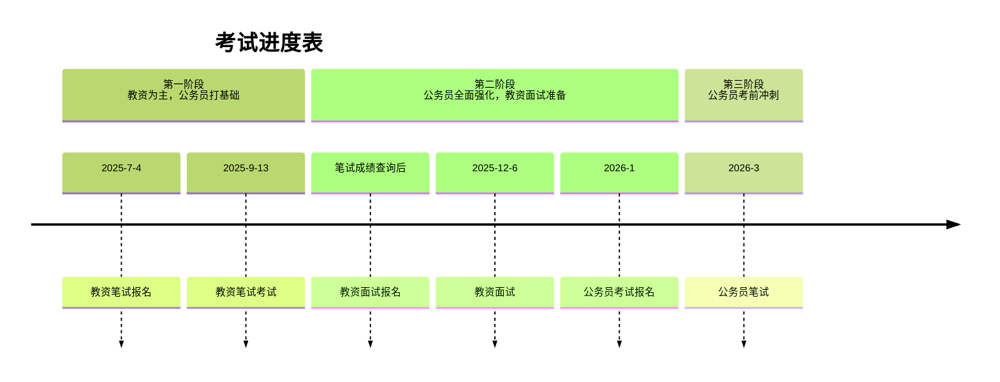

**PS**: 
- 公务员考试具体时间关注[河南人事考试官网](http://www.hnrsks.com/index.html?siteCode=hnsrskszx)
- [教资报名入口](https://ntce.neea.edu.cn/)

---

### **备考总原则**
1. **优先级分配**：  
   - **前期（3-8月）**：主攻教资，辅以公务员基础。  
   - **后期（9月-次年3月）**：主攻公务员省考，同步准备教资面试（若笔试通过）。  
2. **每日学习时长**：  
   - **工作日**：4-6小时。  

---

### **第一阶段：2025年3月6日-2025年8月31日（教资为主，公务员打基础）**
#### **目标**：  
- 系统学习教资笔试科目（教育知识+信息技术学科）。  
- 公务员行测初步学习（常识、言语、判断、资料分析）。  

#### **每日学习计划**（5小时）：  
| 时间段       | 内容安排                                                                                       |     |
| --------- | ------------------------------------------------------------------------------------------ | --- |
| **上午2小时** | **教资备考**：<br>- 1小时《教育知识与能力》（教材+简答题背诵）<br>- 1小时《信息技术学科》（教材+案例分析）                            |     |
| **下午2小时** | **公务员备考**：<br>- 0.5小时行测「常识判断」（每日10题）<br>- 0.5小时行测「言语理解」（片段阅读+选词填空）<br>- 1小时行测「资料分析」（公式+真题） |     |
| **晚上1小时** | **复盘**：整理教资错题本，总结行测技巧。                                                                     |     |

---

### **第二阶段：2025年9月1日-2026年1月31日（公务员全面强化，教资面试准备）**
#### **目标**：  
- 教资面试冲刺（若笔试通过）。  
- 公务员行测+申论系统学习，重点突破薄弱模块。  

#### **每日学习计划**（6小时）：  
| 时间段       | 内容安排                                                                 |     |
| --------- | -------------------------------------------------------------------- | --- |
| **上午3小时** | **公务员备考**：<br> 1.5小时行测「判断推理」（图形推理+逻辑判断）<br> 1.5小时行测「数量关系」（工程问题、排列组合） |     |
| **下午2小时** | **申论学习**：<br> 1小时归纳概括题+提出对策题<br> 1小时大作文（框架+素材积累）                     |     |
| **晚上1小时** | **教资面试**：<br> 结构化问答（每日2题）+试讲练习（录制视频复盘）                               |     |


---

### **第三阶段：2026年2月1日-2026年3月15日（公务员考前冲刺）**
#### **目标**：  
- 全真模拟公务员考试，查漏补缺，调整心态。  

#### **每日学习计划**（6小时）：  
| 时间段       | 内容安排                                                                 |  
|--------------|--------------------------------------------------------------------------|  
| **上午3小时** | **行测全真模拟**：每日1套真题卷（严格限时110分钟），分析错题。          |  
| **下午3小时** | **申论全真模拟**：每周3次大作文+2次小题训练（限时完成）。              |  
  

---

### **时间分配示意图**
```  
2025年3月-8月：教资70% + 公务员30%  
2025年9月-2026年1月：公务员80% + 教资面试20%（若笔试通过）  
2026年2月-3月：公务员100%  
```

---

### **每日时间表示例（工作日）**  
```  
6:30-7:20   起床+吃饭
7:30-8:00   背诵教资简答题/行测公式  
8:10-11:30  上午学习（按阶段分配，保证定量，灵活调整时间）  
14:00-18:00 下午学习  
19:00-21:00 晚间复盘+自由学习  
23:00       休息  
```
