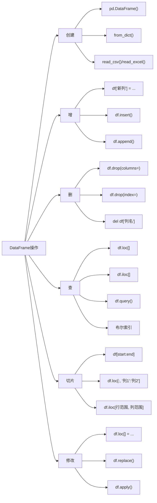

---
### **操作说明**
#### 1. **创建**
- **`pd.DataFrame()`**: 通过字典、列表等直接创建 DataFrame。
- **`from_dict()`**: 将字典转换为 DataFrame。
- **`read_csv()/read_excel()`**: 从文件读取数据生成 DataFrame。

#### 2. **增**
- **`df['新列'] = ...`**: 直接添加新列。
- **`df.insert()`**: 在指定位置插入列。
- **`df.append()`**: 追加行数据（需用 `pd.concat()` 替代）。

#### 3. **删**
- **`df.drop(columns=)`**: 删除指定列。
- **`df.drop(index=)`**: 删除指定行。
- **`del df['列名']`**: 直接删除列。

#### 4. **查**
- **`df.loc[]`**: 按标签查询行或列。
- **`df.iloc[]`**: 按位置索引查询行或列。
- **`df.query()`**: 通过表达式筛选数据。
- **布尔索引**: 用条件表达式筛选行。

#### 5. **切片**
- **`df[start:end]`**: 按行位置范围切片。
- **`df.loc[:, '列1':'列2']`**: 按列标签范围切片。
- **`df.iloc[行范围, 列范围]`**: 按行列位置切片。

#### 6. **修改**
- **`df.loc[] = ...`**: 按标签修改数据。
- **`df.replace()`**: 替换特定值。
- **`df.apply()`**: 应用函数修改数据。

---