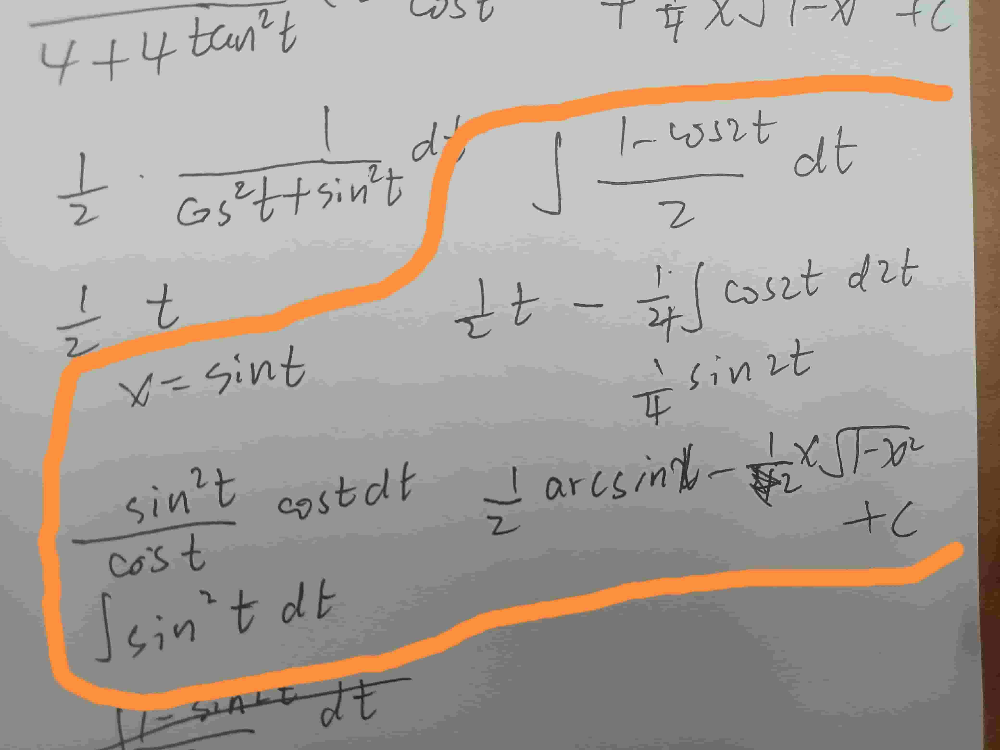

哎呀，其实这部分没啥总结的，全是公式的运用
记录一下自己**吃一堑再吃一堑又吃一堑**的题型算了
### type one：关于三角函数$\tan^2 x$

$$
\tan^2 x=\sec^2 x -1
$$
这个式子的运用

以我的观察，**只要出现**$\tan^2 x$，必用这个式子
### type two：关于其他常见积分
$$
\int \frac{1}{x^2 + a^2} dx = \frac{1}{a} \arctan\left(\frac{x}{a}\right) + C
$$
  
  能记起来公式就套公式，想不起来公式就令$x=a\tan x$，这一道题是$x+1=2\tan x$,也可以得出来结果
  
  这个形式太难与这个积分公式联想起来了
  暂时总结成：
  **分母是二次函数且没有零点的时候，第一个考虑的就是这个式子**
  
  又碰见一道，看来我的总结对了，嘻嘻(#^.^#)
  这一道题多了一个不同点是：**分子**，注意这个方法，先凑一下消去分子的影响再套公式
  
###  type three：凑项、裂项
这种题型的分子分母有多项式

这个是凑项

这个是裂项
第二个分母项减第一个分母项，得到的常数提到前边放到分母位置，再把两分母拆开就好了
有时候裂项和凑项会同时用
### type four：分部积分的公式

不记公式，口述一遍：
对其中一个项积分（求原函数），乘以剩下的那个项
减去，画一个积分符号
抄下那个原函数，对剩下的那个项求导dx
**总结**：**前面积分一个，后面求导一个**
记忆口诀：**前积后导，中间减号；选错重来，多试就好！**

~~根据 ​**LIATE法则**​（对数、反三角、代数、三角、指数），优先选容易积分或求导后简化的函数~~
前边积分一个，适合我的顺序是：指数、三角、代数（幂函数$x^n$）、反三角、对数，也就是优先挑指数积分


### type five：积分积出原来的式子

建立一个等式，然后通过移项等操作解出这个方程
而且而且，**这个积分顺序好像不是严格的指数**、三角、代数（幂函数$x^n$）、反三角、对数，这一题就是直接弄三角

### type six：半角公式的运用

公式一：$\cos 2\alpha = \cos^2 \alpha - \sin^2 \alpha = 2 \cos^2 \alpha - 1 = 1 - 2 \sin^2 \alpha$  
公式二：$\int \frac{1}{\cos^2 x} dx=\int \sec^2 x dx = \tan x + C$

第一，把sin变成cos 
第二，**升次**，用公式二求积分（这个是升次，后边有一个是降次的，注意观察）
再看这一道题

### type seven：分母有$\sqrt{a^2\pm x^2}$

**最麻烦的类型**

第一个题不用答案的方法

观察这种类型，先换元，$x=\sin t或者x=tan t$第一道题也这样写，令$x=\sin x$,然后还需要**降次**，其实降次还是升次没啥规律只能随机应变